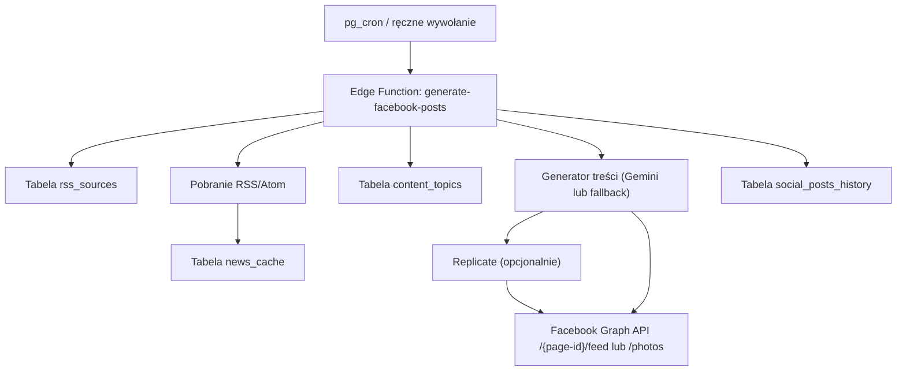

---

# facebook-autopost-supabase

Narzędzie open-source dla NGO i organizacji społecznych, które chcą automatycznie utrzymywać aktywność na Facebooku — bez potrzeby zatrudniania osoby do social mediów i bez ręcznego przeglądania newsów każdego dnia.

## Jak to działa

Projektem jest pojedyncza Supabase Edge Function (`generate-facebook-posts`), którą uruchamiasz na harmonogramie (np. co 3 dni). Przy każdym uruchomieniu funkcja samodzielnie:

1. **pobiera newsy** ze skonfigurowanych kanałów RSS — możesz podać dowolne źródła branżowe, lokalne portale, albo agregatory tematyczne,
2. **wybiera najlepszy nieużyty artykuł** pasujący do aktualnego tematu rotacji (granty, wolontariat, events itp.),
3. **generuje treść posta** — domyślnie przez Gemini AI, a jeśli nie masz klucza Gemini, to przez deterministyczny szablon oparty na danych z RSS,
4. **opcjonalnie generuje grafikę** do posta przez Replicate (modele Flux/SDXL),
5. **publikuje post** na Twojej Facebook Page przez Graph API,
6. **zapisuje historię** każdego posta (treść, status, błędy) w bazie Supabase — masz pełen audyt co i kiedy zostało opublikowane.

Cały pipeline działa serwerowo. Żadne tokeny ani klucze API nie trafiają do frontendu — wszystko żyje w Supabase Secrets i jest odczytywane wyłącznie w środowisku Edge Function.

---

## Szybki start (TL;DR)

> Chcesz po prostu uruchomić — bez czytania całego README? Poniżej minimalna ścieżka.

```
1. Utwórz projekt Supabase  →  zapisz PROJECT_REF i SERVICE_ROLE_KEY
2. Utwórz Meta App          →  wygeneruj FACEBOOK_PAGE_ACCESS_TOKEN i FACEBOOK_PAGE_ID
3. Sklonuj to repo          →  supabase link --project-ref <PROJECT_REF>
4. Wgraj schemat bazy       →  supabase db push
5. Ustaw sekrety            →  supabase secrets set ...  (sekcja 6.3)
   (opcjonalnie branding obrazu: IMAGE_STYLE_REFERENCE_URL / IMAGE_BRAND_LOGO_URL — sekcje 6.3.1 i 6.3.2)
6. Wdróż funkcję            →  supabase functions deploy generate-facebook-posts
7. Przetestuj               →  curl ... -d '{"dry_run":true}'  (sekcja 7)
8. Ustaw harmonogram        →  pg_cron  (sekcja 8)
```

Szczegóły każdego kroku znajdziesz w odpowiedniej sekcji poniżej.

---

## Gdzie znaleźć PROJECT_REF i SERVICE_ROLE_KEY

Te dwie wartości pojawiają się w całym README. Oto gdzie je znaleźć:

| Wartość | Gdzie | Ścieżka w dashboardzie |
| --- | --- | --- |
| `PROJECT_REF` | [Supabase Dashboard](https://supabase.com/dashboard) | `Project Settings → General → Reference ID` |
| `SERVICE_ROLE_KEY` | [Supabase Dashboard](https://supabase.com/dashboard) | `Project Settings → API → service_role (secret)` |
| `SUPABASE_URL` | [Supabase Dashboard](https://supabase.com/dashboard) | `Project Settings → API → Project URL` |

> **Uwaga:** `SERVICE_ROLE_KEY` ma pełny dostęp do bazy — traktuj go jak hasło. Nie commituj go do repo, nie wklejaj publicznie.

---

## 1. Co to robi i jak się spina

Pipeline jednego uruchomienia:

1. Edge Function czyta aktywne źródła RSS z tabeli `rss_sources`.
2. Pobiera wpisy RSS/Atom, filtruje i zapisuje do `news_cache`.
3. Wybiera temat z rotacji (`content_topics`) i najlepszy nieużyty news.
4. Generuje treść posta:
- tryb AI (Gemini), jeśli jest `GEMINI_API_KEY`,
- tryb fallback (deterministyczny szablon), jeśli brak Gemini.
5. Opcjonalnie generuje obraz przez Replicate (tryb `image` lub `auto`).
6. Publikuje post na Facebook Page przez Graph API (`/{page-id}/feed` lub `/{page-id}/photos`).
7. Zapisuje wynik i status do `social_posts_history`.
8. Oznacza news/topic jako użyte (żeby ograniczyć duplikaty).



## 2. Architektura i granice bezpieczeństwa

### Gdzie są sekrety

Sekrety są trzymane w Supabase Edge Functions Secrets i odczytywane w runtime przez `Deno.env.get(...)`.

Kluczowe sekrety:
- `FACEBOOK_PAGE_ID`
- `FACEBOOK_PAGE_ACCESS_TOKEN`
- `SUPABASE_URL`
- `SUPABASE_SERVICE_ROLE_KEY`
- opcjonalnie `GEMINI_API_KEY`
- opcjonalnie `REPLICATE_API_TOKEN`

### Mapa sekretów (source of truth)

| Sekret | Skąd go wziąć | Gdzie ustawić | Do czego służy |
| --- | --- | --- | --- |
| `FACEBOOK_PAGE_ID` | `id` z odpowiedzi `GET /me/accounts` | `supabase secrets set` | Identyfikacja strony publikującej |
| `FACEBOOK_PAGE_ACCESS_TOKEN` | `access_token` z odpowiedzi `GET /me/accounts` | `supabase secrets set` | Autoryzacja `POST /{page-id}/feed` i `POST /{page-id}/photos` |
| `SUPABASE_URL` | Dashboard Supabase (Project URL) | `supabase secrets set` | URL API projektu używany przez klienta DB w funkcji |
| `SUPABASE_SERVICE_ROLE_KEY` | Dashboard Supabase (API keys) | `supabase secrets set` | Pełny dostęp serwerowy do tabel (`news_cache`, `content_topics`, itd.) |
| `GEMINI_API_KEY` | [Google AI Studio](https://aistudio.google.com/apikey) | `supabase secrets set` | Generowanie treści posta (tryb AI) |
| `REPLICATE_API_TOKEN` | [Replicate → Account → API tokens](https://replicate.com/account/api-tokens) | `supabase secrets set` | Generowanie obrazów dla postów obrazkowych |

### Jak sekret "przechodzi" przez system

1. Ustawiasz sekret przez CLI (`supabase secrets set ...`) albo w Dashboard.
2. Supabase przechowuje sekret po swojej stronie.
3. Podczas wykonania Edge Function sekret jest dostępny jako zmienna środowiskowa.
4. Kod używa sekretu tylko serwerowo:
- do zapytań DB (`SUPABASE_SERVICE_ROLE_KEY`),
- do wywołania Facebook Graph API (`FACEBOOK_PAGE_ACCESS_TOKEN`),
- do wywołania Replicate (`REPLICATE_API_TOKEN`) w trybie obrazkowym.
5. Sekret nie jest wysyłany do frontendu ani zapisywany w bazie.

### Dlaczego `verify_jwt = true`

W tym repo funkcja ma `verify_jwt = true` (plik `supabase/config.toml`), więc nie przyjmie anonimowego requestu.
Wywołuj ją tylko backend-backend (cron, CI, serwer).

## 3. Wymagania wstępne

- Konto [Supabase](https://supabase.com/dashboard) + nowy projekt.
- [Supabase CLI](https://supabase.com/docs/guides/cli).
- Facebook Page, do której masz uprawnienia administracyjne.
- [Meta Developer App](https://developers.facebook.com/) (dla tokenów).
- (Opcjonalnie) klucz [Gemini API](https://aistudio.google.com/apikey).
- (Opcjonalnie) konto [Replicate](https://replicate.com/account/api-tokens) do postów obrazkowych.

## 4. Facebook: dokładne pozyskanie danych (tokeny i sekrety)

Poniższy proces jest najważniejszy, bo od niego zależy działanie publikacji.

### 4.1. Przygotuj Meta App

1. Wejdź na [Meta for Developers](https://developers.facebook.com/) i utwórz aplikację (typ biznesowy).
2. Powiąż aplikację z odpowiednim [Business Managerem](https://business.facebook.com/) (jeśli używacie BM).
3. Upewnij się, że konto użytkownika ma dostęp do strony (Page) i zadania umożliwiające publikację.
4. W panelu aplikacji zapisz:
- `APP_ID`,
- `APP_SECRET` (zwykle w `Settings → Basic`).
5. Na starcie trzymaj aplikację w trybie developerskim i testuj na stronie testowej.
6. Gdy wdrażasz produkcję dla szerszego grona kont, przygotuj [app review](https://developers.facebook.com/docs/app-review) wymaganych uprawnień.

### 4.2. Wygeneruj User Access Token (krótkotrwały)

Najprościej przez [Graph API Explorer](https://developers.facebook.com/tools/explorer/):
- wybierz swoją aplikację,
- wygeneruj token użytkownika,
- zaznacz uprawnienia wymagane do publikowania na stronie.

Minimalnie praktyczne scope'y do tego use-case ([pełna lista uprawnień stron](https://developers.facebook.com/docs/permissions#p)):
- [`pages_manage_posts`](https://developers.facebook.com/docs/permissions#pages_manage_posts)
- [`pages_read_engagement`](https://developers.facebook.com/docs/permissions#pages_read_engagement)
- [`pages_show_list`](https://developers.facebook.com/docs/permissions#pages_show_list)

### 4.3. Zamień na Long-Lived User Token

Wymagane dane:
- `APP_ID`
- `APP_SECRET`
- `SHORT_LIVED_USER_TOKEN`

Przykład:

```bash
curl -G "https://graph.facebook.com/v24.0/oauth/access_token" \
  --data-urlencode "grant_type=fb_exchange_token" \
  --data-urlencode "client_id=<APP_ID>" \
  --data-urlencode "client_secret=<APP_SECRET>" \
  --data-urlencode "fb_exchange_token=<SHORT_LIVED_USER_TOKEN>"
```

W odpowiedzi dostaniesz dłużej ważny token użytkownika ([dokumentacja long-lived tokens](https://developers.facebook.com/docs/facebook-login/guides/access-tokens/get-long-lived)).

Uwaga praktyczna:
- `APP_SECRET` to sekret aplikacji Meta, a nie token strony.
- Trzymaj go tylko w bezpiecznym miejscu operatorskim (nigdy w repo).

### 4.4. Pobierz Page Access Token i Page ID

Użyj dłużej ważnego tokenu użytkownika:

```bash
curl -G "https://graph.facebook.com/v24.0/me/accounts" \
  --data-urlencode "access_token=<LONG_LIVED_USER_TOKEN>"
```

W odpowiedzi szukasz:
- `id` -> to `FACEBOOK_PAGE_ID`,
- `access_token` -> to `FACEBOOK_PAGE_ACCESS_TOKEN`.

To właśnie `FACEBOOK_PAGE_ACCESS_TOKEN` trafia potem do Supabase Secrets i jest używany przez Edge Function do publikacji.

### 4.5. Weryfikacja tokenu (zalecane)

Możesz sprawdzić ważność i uprawnienia tokenu w [Access Token Debugger](https://developers.facebook.com/tools/debug/accesstoken/).

Szybki test publikacji (na stronie testowej):

```bash
curl -X POST "https://graph.facebook.com/v24.0/<FACEBOOK_PAGE_ID>/feed" \
  --data-urlencode "message=Test post from automation" \
  --data-urlencode "access_token=<FACEBOOK_PAGE_ACCESS_TOKEN>"
```

Jeżeli dostajesz ID posta, token jest poprawny.

### 4.6. Ważne uwagi operacyjne

- Tokeny mogą stracić ważność po zmianach uprawnień/roli/hasła/polityk Meta.
- Traktuj token jak hasło produkcyjne.
- Po incydencie bezpieczeństwa: natychmiastowa rotacja tokenu.

## 5. Struktura repozytorium

```
supabase/
  config.toml
  .env.local.example
  migrations/
    202602200001_facebook_autopost_schema.sql
    202602200002_social_posts_history_image_fields.sql
  functions/
    import_map.json
    _shared/
      content-generator.ts
      facebook.ts
      image-generator.ts
      news-fetcher.ts
      social-news-selection.ts
      supabase.ts
      types.ts
    generate-facebook-posts/
      index.ts
```

## 6. Supabase: instalacja i deploy

### 6.1. Podłącz repo do projektu Supabase

```bash
supabase login
supabase link --project-ref <PROJECT_REF>
```

### 6.2. Wgraj migracje

```bash
supabase db push
```

To utworzy tabele:
- `rss_sources`
- `news_cache`
- `content_topics`
- `social_posts_history`

### 6.3. Ustaw sekrety runtime

```bash
supabase secrets set SUPABASE_URL=https://<PROJECT_REF>.supabase.co
supabase secrets set SUPABASE_SERVICE_ROLE_KEY=<YOUR_SERVICE_ROLE_KEY>
supabase secrets set FACEBOOK_PAGE_ID=<YOUR_FACEBOOK_PAGE_ID>
supabase secrets set FACEBOOK_PAGE_ACCESS_TOKEN=<YOUR_FACEBOOK_PAGE_ACCESS_TOKEN>
```

Opcjonalnie:

```bash
supabase secrets set GEMINI_API_KEY=<YOUR_GEMINI_API_KEY>
supabase secrets set REPLICATE_API_TOKEN=<YOUR_REPLICATE_API_TOKEN>
supabase secrets set REPLICATE_MODEL=google/nano-banana-pro
supabase secrets set FB_GRAPH_API_VERSION=v24.0
supabase secrets set ORGANIZATION_NAME="Twoja organizacja"
supabase secrets set ORGANIZATION_CONTEXT="Pomagamy NGO wdrażać technologie"
supabase secrets set POST_CALL_TO_ACTION="Obserwuj nas po więcej aktualności"
supabase secrets set DEFAULT_POST_LANGUAGE="Polish"
supabase secrets set IMAGE_POST_EVERY_NTH=2
supabase secrets set DEFAULT_POST_MODE=auto
supabase secrets set IMAGE_APPEND_LINK_TO_CAPTION=true
supabase secrets set IMAGE_STYLE_REFERENCE_URL=<PUBLIC_URL_STYLU>
supabase secrets set IMAGE_BRAND_LOGO_URL=<PUBLIC_URL_LOGOTYPU>
supabase secrets set IMAGE_ASPECT_RATIO=1:1
supabase secrets set IMAGE_OUTPUT_FORMAT=jpg
```

### 6.3.1. Replicate: obraz referencyjny i logotyp

Jeśli chcesz, żeby kolejne grafiki trzymały jeden styl (i branding), ustaw:
- `IMAGE_STYLE_REFERENCE_URL` — publiczny URL do przykładowej grafiki referencyjnej (styl, klimat, kolorystyka).
- `IMAGE_BRAND_LOGO_URL` — publiczny URL do logotypu (najlepiej PNG z transparentnym tłem).

Ważne:
- URL-e muszą być publicznie dostępne z internetu (model pobiera je po URL).
- Najlepiej używać stabilnych, własnych linków (np. publiczny bucket w Supabase Storage).
- Przy `DEFAULT_POST_MODE=auto` obraz i tak może przełączyć się na post linkowy, jeśli generacja się nie powiedzie (fallback).

### 6.3.2. Gotowy przykład: Supabase Storage -> public URL -> Replicate

1. W dashboardzie Supabase wejdź w `Storage` i utwórz bucket np. `brand-assets` z opcją `Public bucket`.
2. Wgraj plik `style/reference.jpg` (grafika referencyjna stylu).
3. Wgraj plik `logo/logo.png` (logotyp).
4. Publiczny URL buduj według wzoru: `https://<PROJECT_REF>.supabase.co/storage/v1/object/public/<BUCKET>/<SCIEZKA_PLIKU>`.
5. Dla powyższego przykładu URL stylu to: `https://<PROJECT_REF>.supabase.co/storage/v1/object/public/brand-assets/style/reference.jpg`.
6. Dla powyższego przykładu URL logotypu to: `https://<PROJECT_REF>.supabase.co/storage/v1/object/public/brand-assets/logo/logo.png`.
7. Ustaw sekrety:

```bash
supabase secrets set IMAGE_STYLE_REFERENCE_URL=https://<PROJECT_REF>.supabase.co/storage/v1/object/public/brand-assets/style/reference.jpg
supabase secrets set IMAGE_BRAND_LOGO_URL=https://<PROJECT_REF>.supabase.co/storage/v1/object/public/brand-assets/logo/logo.png
supabase secrets set DEFAULT_POST_MODE=image
```

8. Zrób test obrazka na stronie testowej:

```bash
curl -X POST "https://<PROJECT_REF>.supabase.co/functions/v1/generate-facebook-posts" \
  -H "Authorization: Bearer <SERVICE_ROLE_KEY>" \
  -H "Content-Type: application/json" \
  -d '{"post_mode":"image"}'
```

9. Sprawdź wynik:

```sql
select id, status, has_generated_image, image_url, created_at
from public.social_posts_history
order by created_at desc
limit 5;
```

### 6.4. Deploy funkcji

```bash
supabase functions deploy generate-facebook-posts
```

### 6.5. Lokalne testowanie przed deployem (opcjonalnie)

Możesz uruchomić funkcję lokalnie zanim wyślesz ją na produkcję. Wymaga to lokalnej instancji Supabase lub podłączenia do zdalnego projektu przez `.env.local`.

```bash
# skopiuj przykład i uzupełnij wartości
cp supabase/.env.local.example supabase/.env.local

# uruchom funkcję lokalnie
supabase functions serve generate-facebook-posts --env-file supabase/.env.local
```

W drugim terminalu wywołaj dry run:

```bash
curl -X POST "http://localhost:54321/functions/v1/generate-facebook-posts" \
  -H "Authorization: Bearer <SERVICE_ROLE_KEY>" \
  -H "Content-Type: application/json" \
  -d '{"dry_run":true}'
```

Lokalne uruchomienie nie publikuje niczego na Facebooku (dry run), ale przechodzi cały pipeline i pokazuje logi w czasie rzeczywistym — bardzo przydatne przy debugowaniu.

---

## 7. Testy end-to-end

### Dry run

Nie publikuje na Facebooku, ale przechodzi pipeline i zapisuje historię.

```bash
curl -X POST "https://<PROJECT_REF>.supabase.co/functions/v1/generate-facebook-posts" \
  -H "Authorization: Bearer <SERVICE_ROLE_KEY>" \
  -H "Content-Type: application/json" \
  -d '{"dry_run":true}'
```

### Live run

```bash
curl -X POST "https://<PROJECT_REF>.supabase.co/functions/v1/generate-facebook-posts" \
  -H "Authorization: Bearer <SERVICE_ROLE_KEY>" \
  -H "Content-Type: application/json" \
  -d '{}'
```

### Wymuszenie trybu obrazkowego

```bash
curl -X POST "https://<PROJECT_REF>.supabase.co/functions/v1/generate-facebook-posts" \
  -H "Authorization: Bearer <SERVICE_ROLE_KEY>" \
  -H "Content-Type: application/json" \
  -d '{"post_mode":"image"}'
```

### Wymuszenie trybu linkowego

```bash
curl -X POST "https://<PROJECT_REF>.supabase.co/functions/v1/generate-facebook-posts" \
  -H "Authorization: Bearer <SERVICE_ROLE_KEY>" \
  -H "Content-Type: application/json" \
  -d '{"post_mode":"link"}'
```

### Szybkie SQL do obserwacji

```sql
select id, platform, status, created_at, posted_at, error_message
from public.social_posts_history
order by created_at desc
limit 20;

select id, title, category, used, fetched_at
from public.news_cache
order by fetched_at desc
limit 20;
```

## 8. Harmonogram (pg_cron)

### Wersja prosta

```sql
create extension if not exists pg_cron;
create extension if not exists pg_net;

select cron.schedule(
  'generate-facebook-posts-job',
  '0 9 */3 * *',
  $$
  select net.http_post(
    url := 'https://<PROJECT_REF>.supabase.co/functions/v1/generate-facebook-posts',
    headers := jsonb_build_object(
      'Content-Type', 'application/json',
      'Authorization', 'Bearer <SERVICE_ROLE_KEY>'
    ),
    body := '{}'::jsonb
  );
  $$
);
```

### Wersja bezpieczniejsza (zalecana)

Przechowaj `SERVICE_ROLE_KEY` w Vault i odczytuj go w jobie, zamiast wpisywać jawnie w SQL.

```sql
create extension if not exists pg_cron;
create extension if not exists pg_net;
create extension if not exists supabase_vault;

select vault.create_secret('<SERVICE_ROLE_KEY>', 'service_role_key', 'Service role key for cron -> edge function');

select cron.schedule(
  'generate-facebook-posts-job',
  '0 9 */3 * *',
  $$
  select net.http_post(
    url := 'https://<PROJECT_REF>.supabase.co/functions/v1/generate-facebook-posts',
    headers := jsonb_build_object(
      'Content-Type', 'application/json',
      'Authorization', 'Bearer ' || (
        select decrypted_secret
        from vault.decrypted_secrets
        where name = 'service_role_key'
        limit 1
      )
    ),
    body := '{}'::jsonb
  );
  $$
);
```

## 9. Dostosowanie dla organizacji

### 9.1. Źródła RSS

Poniżej 4 gotowe źródła dla NGO (sprawdzone: `2026-02-21`, `HTTP 200`, poprawny XML RSS, aktywne wpisy):
- `NIW (granty, konkursy, sektor obywatelski)` → `https://niw.gov.pl/feed/`
- `PortalSamorzadowy: Społeczeństwo (sprawy lokalne i publiczne)` → `https://www.portalsamorzadowy.pl/rss/spoleczenstwo.xml`
- `RynekZdrowia: Polityka zdrowotna (tematy zdrowia publicznego)` → `https://www.rynekzdrowia.pl/Kanal/polityka_zdrowotna.xml`
- `Days Of The Year (dni nietypowe i okazjonalne)` → `https://www.daysoftheyear.com/feed/`

```sql
select * from public.rss_sources order by priority;

insert into public.rss_sources (source_name, feed_url, category, priority)
select v.source_name, v.feed_url, v.category, v.priority
from (
  values
    ('NIW', 'https://niw.gov.pl/feed/', 'grants', 10),
    ('PortalSamorzadowy - Spoleczenstwo', 'https://www.portalsamorzadowy.pl/rss/spoleczenstwo.xml', 'ngo', 20),
    ('RynekZdrowia - Polityka Zdrowotna', 'https://www.rynekzdrowia.pl/Kanal/polityka_zdrowotna.xml', 'ngo', 30),
    ('Days Of The Year', 'https://www.daysoftheyear.com/feed/', 'culture', 40)
) as v(source_name, feed_url, category, priority)
where not exists (
  select 1
  from public.rss_sources rs
  where rs.feed_url = v.feed_url
);
```

### 9.2. Tematy i szablony

Edytujesz `content_topics.prompt_template_facebook`.

Dostępne placeholdery:
- `{{news_title}}`
- `{{news_description}}`
- `{{news_url}}`
- `{{organization_name}}`
- `{{organization_context}}`
- `{{post_call_to_action}}`
- `{{post_language}}`

### 9.3. Wymuszenie konkretnego tematu

```bash
curl -X POST "https://<PROJECT_REF>.supabase.co/functions/v1/generate-facebook-posts" \
  -H "Authorization: Bearer <SERVICE_ROLE_KEY>" \
  -H "Content-Type: application/json" \
  -d '{"topic_key":"grants","dry_run":true,"skip_fetch":true}'
```

Tryb obrazkowy dla konkretnego tematu:

```bash
curl -X POST "https://<PROJECT_REF>.supabase.co/functions/v1/generate-facebook-posts" \
  -H "Authorization: Bearer <SERVICE_ROLE_KEY>" \
  -H "Content-Type: application/json" \
  -d '{"topic_key":"grants","post_mode":"image"}'
```

## 10. Lista kontrolna przed pierwszym uruchomieniem

Przed pierwszym live runem przejdź przez tę listę:

- [ ] Projekt Supabase utworzony, `PROJECT_REF` i `SERVICE_ROLE_KEY` zapisane
- [ ] `supabase link --project-ref <PROJECT_REF>` wykonany pomyślnie
- [ ] `supabase db push` wykonany — tabele istnieją w bazie
- [ ] `supabase secrets set` ustawiony dla wszystkich 4 wymaganych sekretów (`SUPABASE_URL`, `SUPABASE_SERVICE_ROLE_KEY`, `FACEBOOK_PAGE_ID`, `FACEBOOK_PAGE_ACCESS_TOKEN`)
- [ ] `supabase secrets list` potwierdza, że sekrety są widoczne
- [ ] Token Facebooka zweryfikowany przez [Access Token Debugger](https://developers.facebook.com/tools/debug/accesstoken/) — status `valid`, uprawnienia `pages_manage_posts` obecne
- [ ] `supabase functions deploy generate-facebook-posts` zakończony bez błędów
- [ ] Dry run (`"dry_run": true`) zwraca `200 OK` i status `dry_run` w odpowiedzi
- [ ] W tabeli `social_posts_history` pojawił się rekord po dry runie
- [ ] Live run (`{}`) zwraca `200 OK` i post jest widoczny na Facebook Page
- [ ] pg_cron skonfigurowany i job widoczny w `cron.job`

---

## 11. Troubleshooting

### "FACEBOOK_PAGE_ID and FACEBOOK_PAGE_ACCESS_TOKEN are required"

Brakuje sekretów albo funkcja ich nie widzi. Sprawdź:
- `supabase secrets list`
- czy deploy był po ustawieniu sekretów (w razie wątpliwości zrób deploy ponownie).

### "Facebook API error"

Najczęściej:
- wygasły token,
- brak wymaganych uprawnień,
- brak dostępu konta do strony,
- strona niepowiązana poprawnie z aplikacją/biznesem.

### "REPLICATE_API_TOKEN missing" lub brak obrazka mimo `post_mode=image`

Najczęściej:
- brak `REPLICATE_API_TOKEN` w secrets,
- błąd po stronie modelu Replicate,
- limit/timeout na generacji obrazu.

Funkcja ma fallback: jeśli obraz się nie wygeneruje, publikuje post linkowy.

### Brak postów mimo działania funkcji

- sprawdź `rss_sources.is_active`,
- sprawdź czy w `news_cache` są rekordy z `used = false`,
- sprawdź czy `content_topics.is_active = true`.

## 12. Runbook operacyjny

1. Co tydzień: kontrola `social_posts_history`.
2. Co miesiąc: test manualny live run.
3. Co 1-2 miesiące: weryfikacja ważności tokenu Facebook.
4. Po każdym incydencie: rotacja `FACEBOOK_PAGE_ACCESS_TOKEN`, `SUPABASE_SERVICE_ROLE_KEY` i (jeśli używany) `REPLICATE_API_TOKEN`.

## 13. Bezpieczeństwo

Pełna polityka bezpieczeństwa jest w pliku `SECURITY.md`.

## 14. Licencja

MIT
